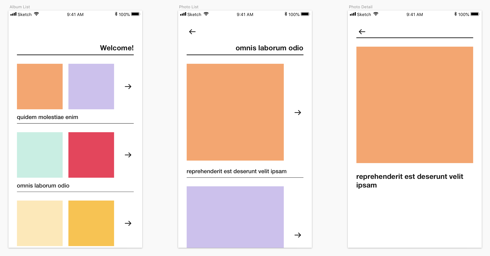

# JSONPlaceholder

A demo React Native app to that interacts with the [JSONPlaceholder](https://jsonplaceholder.typicode.com/) API.

## Features

- React Navigation.
- Redux for state management.
- `redux-persist` for data persistance.
- `react-native-i18n` for internationalization.

## Mockup

A quick Sketch mockup of the complete app to make development easier.



## Demo


## Getting Started

### Pre-requisites:

- Make sure you have the react-native CLI installed.

```
npm install -g react-native-cli
```

### Installation:

- Install dependencies:

```
cd jsonplaceholder-react-native && npm install
```

- Start the package bundler (optional):

```
react-native start --reset-cache
```

#### iOS

- To run it on an iOS simulator:

```
react-native run-ios
```

You also have the option to run it from XCode by opening `ios/JSONPlaceholder.xcodeproj` and clicking the "play" button.

#### Android

- Ensure that you have an Android emulator running and then run:

```
react-native run-android
```

## Issues

### Detox

#### iOS

Make sure if you want to make use of detox to follow the [getting started](https://github.com/wix/detox/blob/master/docs/Introduction.GettingStarted.md) and install the prerequisites and dependencies needed.

#### Android

Currently doesn't work out of the box, so there is a little set up needed in the android project itself. So you will need to follow a seperate [getting started](https://github.com/wix/detox/blob/master/docs/Introduction.Android.md) guide in order to setup detox for android.

Make sure to amend the configurations of the detox config appropriately to match the correct emulator you've selected.
